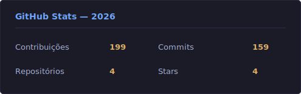

# Lucas dos Santos Santana

Analista de Sistemas com duplo foco em **Backend .NET** e **DevOps**. Desenvolvo APIs e microsserviços com .NET 8+/C# e opero infraestrutura em produção com Docker, GitLab CI/CD, Grafana e Kong API Gateway.

Investiguei e resolvi incidentes de produção, incluindo a redução de consumo de CPU de uma API NestJS de 14% para menos de 3%, e a correção de um vazamento de memória em plugin customizado do Kong API Gateway que reduziu o uso de RAM do servidor de 35% para ~3%. Uso Linux no dia a dia — máquina pessoal e servidores de produção.

---

## Stack

  

| | |
|---|---|
| **Backend** | C# · ASP.NET Core · .NET 8+ · Entity Framework Core · Minimal APIs · JWT |
| **Bancos de dados** | PostgreSQL · SQL Server |
| **Cache / Mensageria** | Redis · Kafka |
| **DevOps** | Docker · GitLab CI/CD · Kong API Gateway · Linux |
| **Observabilidade** | Grafana · Diagnóstico de incidentes · Monitoramento de produção |
| **Scripting** | Python (2 anos) · Bash (1 ano) |
| **Arquitetura** | Clean Architecture · Microsserviços · REST APIs |
| **Testes** | Unitários · Integração (TestContainers + PostgreSQL real) |

---

## Projetos

### [Helpdesk Platform — .NET](https://github.com/Lucas01SX/helpdesk-platform-dotnet)

API REST em C# .NET 10 com ASP.NET Core, EF Core e Clean Architecture.

- State machine de tickets (Open → In Progress → Resolved | Cancelled)
- SLA por prioridade com auto-assign e auto-cancel
- JWT (15 min) + Refresh Token com rotação, Argon2id e reuse detection
- Eventos de domínio assíncronos, auditoria append-only, Serilog com correlationId
- Testes unitários, de arquitetura e de integração com TestContainers

### [Portfólio](https://lucas01sx.github.io)

Portfólio pessoal com apresentação de projetos e stack — **lucas01sx.github.io**

---

## GitHub Stats

---

## Contato

